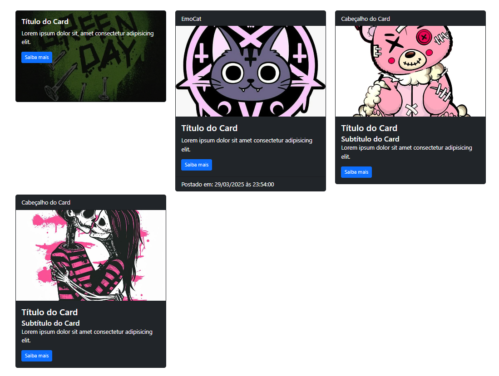

[English Version](README.md) | [Versão em Português](PTBR-README.md)

# Projeto de Cards com Bootstrap

Este projeto demonstra o uso do **Bootstrap** para criar **cards** responsivos e visualmente atraentes. Os cards incluem imagens, títulos, subtítulos e botões, todos estilizados com os componentes e classes utilitárias do Bootstrap.

## Funcionalidades

- Layout responsivo com **3 cards por linha**.
- Cards com **texto sobreposto** às imagens.
- Estilos personalizados para tamanhos consistentes de imagens.
- Uso de **classes utilitárias do Bootstrap** para estilização.

## Tecnologias Utilizadas

- **HTML5**: Para estruturação do conteúdo.
- **CSS3**: Para estilos personalizados.
- **Bootstrap 5**: Para design responsivo e componentes pré-construídos.

## Estrutura do Projeto

- **index.html** - Arquivo HTML principal
- **style.css** - Estilos CSS personalizados
- **bootstrap.min.css** - CSS do Bootstrap
- **bootstrap.bundle.min.js** - JS do Bootstrap
- **imgs** - Imagens para os cards
- **README.md** - Documentação do projeto

## Como Executar
1. Clone este repositório ou baixe os arquivos do projeto.
2. Abra o arquivo `index.html` no seu navegador.
3. Certifique-se de que as pastas `lib` e `img` estão no mesmo diretório que o `index.html`.

## Prévia

---

### Autor

Desenvolvido por **Michael** como parte do curso avançado de Bootstrap da EBAC.